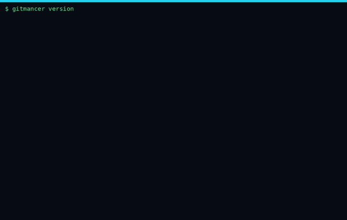

# ⚡ gitmancer

<!-- ⬡ 3D-UPGRADE v1 by Mayank Bhaskar -->
<div align="center">



**made by [Mayank Bhaskar](https://github.com/qtjg)** ·  

### 🧊 3D View



*Floating isometric render — layers hover, data particles stream, shine sweeps.*

</div>

---
🩺 **New tool — `repo-pulse`**: instant git pulse (28-day heat bars, hot files, contributors). Run: `node tools/repo-pulse.mjs`

**Zero-dependency AI CLI agent for your code & your whole GitHub account.**

Give it any OpenAI-compatible AI key (Groq / OpenAI / OpenRouter / Z.ai / Ollama / custom) plus a
GitHub token, and it becomes a terminal-native agent that reads and writes your code, runs
commands, commits, pushes, creates repos, and manages issues — you talk, it ships.

   

```bash
$ gitmancer ask "add input validation to signup.js and run the tests"
⚙ read_file signup.js
⚙ write_file signup.js (1,204 bytes)
⚙ run_cmd `node --test`  →  ✔ 12 passing
Done — added validation for empty email/password and rate-limit guard. Tests pass.

$ gitmancer ship
staged 3 file(s)
commit: feat(auth): validate signup inputs + rate-limit guard
✔ pushed main → origin
```

## 📺 See it run — a real recording

Every frame below is **real CLI output**, captured with `gitmancer record` — version banner, the plugin system scaffolding and running a plugin command, `secscan` catching (and redacting) a planted GitHub token, and the full help menu. No mocked screens.



<sub>Terminal-native playback: <code>gitmancer replay docs/demo.cast</code> · regenerate both artifacts with <code>node scripts/gen-demo-cast.js && python3 scripts/cast-to-gif.py</code>.</sub>

## What's new in v0.6.0 — plugins · MCP · completions · plans · sandbox

- **`plugin`** — user plugin system: drop a `.js` file in `~/.gitmancer/plugins/` and it becomes a real command (`plugin new` scaffolds one) **and** can register first-class AI agent tools; mutating plugin tools go through the same confirm gate as built-ins. (#1 #11)
- **`mcp`** — Model Context Protocol server over stdio JSON-RPC: IDEs and other agents get `repo_status`, `list_files`, `read_file`, `run_cmd` (read-only by default) and `secscan`. (#2 #10)
- **`completions bash|zsh|fish`** — ready-to-install shell completion, per-command flags included. (#3)
- **`record` / `replay`** — record any command into an asciinema v2 `.cast` and replay it later (this is how the README demo was made). (#4 #5)
- **`plan` / `execute`** — AI drafts an ordered plan (`--write plan.json`), execute runs it step-by-step: shell steps confirm-gated and exit-checked, agent steps run the full agent; `--dry-run` / `--from` / `--only` / `--keep-going`. (#6)
- **`.gitmancer.json` workspace profiles** — per-project model/steps/budget/exclude policy; `yolo` is deliberately not grantable from a file, secrets in a profile are refused. (#7)
- **`usage`** — persistent per-call token & cost dashboard (`~/.gitmancer/usage.jsonl`), rough $ estimates from published rates, clearly labeled. (#8 #13)
- **`ask --resume <id|last>`** — chat transcripts persist after every turn; pick a conversation back up exactly where it died. (#9)
- **`--sandbox`** — agent shell commands run inside docker (network-off, cpu/mem caps) or bubblewrap (`--unshare-all`); no runtime → honest refusal, nothing executes. (#12)

## What's new in v0.5.0 — release autopilot · security · fleet · triage

- **`changelog` / `release`** — AI release notes from any commit range (Keep-a-Changelog style); `release patch|minor|major` bumps the version, writes the CHANGELOG section, commits, tags and (optionally) pushes + publishes the GitHub Release in one shot (`--no-push` / `--skip-gh` / `--dry-run` escapes).
- **`ask --verify`** — the agent must cite file:line receipts; every citation is mechanically re-checked against the worktree and broken ones are flagged.
- **`secscan`** — gitleaks-style secret scanning: 7 rule families (AWS/GitHub/OpenAI/Slack/Google keys, private key blocks, hard-coded secrets), placeholder-aware, previews redacted, `--staged` / `--path` / `--json`, exit 1 when findings → CI/hook friendly.
- **`hook install pre-commit|pre-push|commit-msg`** — installs a managed, idempotent git-hook block that runs `secscan` (fail-closed, fail-open if gitmancer isn't on PATH); `hook list` / `hook uninstall` keep user code intact.
- **`testgen <file>`** — AI-generated unit tests for any source file, framework hinted per language (node:test / vitest / pytest); dry preview by default, `--write` / `--yolo` saves.
- **`explain <target>`** — AI explains a file, a git rev or rev-range (`HEAD~1..HEAD`), or a shell command — target mode auto-detected.
- **`fleet`** — run one action (`status` / `pull` / `secscan` / `run "<cmd>"`) across every repo directly under a root directory, sorted, with `--json` and a failing exit code if any repo fails.
- **`triage <owner/repo>`** — AI triage of open issues: P0–P3 priority, type, label + one-line rationale; `--apply` writes labels to GitHub (confirm-gated).
- e2e suite grew to **138 checks** — all green.

<details>
<summary>What was new in v0.4.0 — memory · undo · watch · batch_edit · prbot</summary>

- **GITMANCER.md project memory** — drop a file in the repo root with your conventions (build cmds, style rules, "do not touch" zones); it's auto-loaded into the AI's context on every `ask`/`agent`/`fix`/`ship`/`watch` run in that repo. `gitmancer memory` creates a starter template or shows the current one.
- **`undo`** — every agent file change is journaled to `~/.gitmancer/undo-journal.jsonl` (prior content kept); `gitmancer undo` reverts the last change, `gitmancer undo 5` reverts five. Fearless automation.
- **`watch "<cmd>"`** — run a command; if it fails the agent auto-fixes the code and re-runs until green (`--max 3` by default). Like `fix`, but loop-tolerant.
- **`batch_edit` agent tool** — the model can now make several exact string replacements in one file per call instead of rewriting whole files → fewer tokens, faster turns, smaller diffs. Exact-match enforced: a `find` matching multiple locations must pass `replace_all`.
- **`prbot`** — watches a repo and AI-reviews every new pull request automatically (`--repo owner/name`, `--interval 300` sweep, `--once` for CI/single pass). Remembers reviewed heads in `~/.gitmancer/prbot.json`, posts severity-tagged verdicts as PR comments (confirm-gated unless `--yolo`).
- **Token metering + `--budget`** — every run now prints a `usage:` line (AI calls · tokens in/out, real numbers when the provider reports usage, estimates otherwise); `ask --budget 200000` stops the agent loop when the soft cap is hit.

</details>

<details>
<summary>What was new in v0.3.1</summary>

- **Parallel tool dispatch** — when the model batches several read-only tool calls (`list_files` / `read_file` / `github_api` GET), they now run concurrently instead of one-by-one; mutating tools (`write_file`, `run_cmd`, non-GET API) stay sequential behind their confirmation gates, so safety semantics are unchanged
- **Request coalescing** — identical in-flight GitHub GETs share a single HTTP request (second caller joins the first one's promise) → no duplicate rate-limit burn when parallel calls read the same endpoint

</details>

<details>
<summary>What was new in v0.3.0</summary>

- **Retry + fallback chain** — transient AI errors (429/5xx) retry with exponential backoff (respects `Retry-After`); add `aiFallbacks` to your config and gitmancer fails over to the next provider/model instead of dying
- **GitHub GET cache** — identical API reads are served from a 10-minute in-process cache (mutations invalidate it, `--no-cache` bypasses) → sweeps and status views are dramatically faster and burn less rate limit
- **`gitmancer review <pr#>`** — AI code review of any pull request: severity-tagged findings (`[blocking]`/`[major]`/`[minor]`/`[nit]`) + an APPROVE / REQUEST CHANGES verdict
- **`gitmancer sweep`** — concurrent batch overview of *all* your repos: open issues, PRs, stars, last push
- **`gitmancer status`** — branch, dirty files, ahead/behind, open issues/PRs, last CI run — one command (`--json` for scripts)
- **`gitmancer doctor`** — checks config, keys, fallback shape, GitHub/AI endpoints and tells you exactly what's broken
- **Context compaction v2** — long sessions compact safely at user-message boundaries (never mid tool-call), so marathon agent turns stay fast
- **Agent tool upgrades** — `run_cmd` gains a `timeout_ms` guard, `read_file` gains `offset`/`limit` pagination for big files
- **`--json` output** for `status` and `sweep` — pipe into `jq`, drive from scripts

</details>

<details>
<summary>What was new in v0.2.0</summary>

- **Streaming output** (SSE with buffered fallback) · **`fix "<cmd>"`** auto-repair · **`pr`** with AI-drafted title/body · **workspace snapshot** in the system prompt · **`--fast`** small-model switch

</details>

## Why

Existing AI CLIs lock you into one provider, need `npm install` rituals, or stop at your
local machine. **gitmancer** is one file, zero dependencies, provider-agnostic, and reaches
all the way to your GitHub account — code, commits, repos, issues — through the same two
keys you already have.

## Install

```bash
curl -fsSL https://raw.githubusercontent.com/qtjg/gitmancer/main/install.sh | sh

# or pin a version / uninstall
curl -fsSL https://raw.githubusercontent.com/qtjg/gitmancer/main/install.sh | sh -s v0.3.0
gitmancer uninstall
```

**Option B — single file (no install):**

```bash
curl -fsSL https://raw.githubusercontent.com/qtjg/gitmancer/main/gitmancer.js -o gitmancer.js
node gitmancer.js --help
```

**Option B — npm global:**

```bash
git clone https://github.com/qtjg/gitmancer.git && cd gitmancer
npm install -g .
gitmancer --help
```

Requires Node 18+ (built-in `fetch`). That's it — there are literally no other dependencies.

## Setup (once)

```bash
gitmancer setup
```

You'll be asked for:

| What | Where to get it | Notes |
|------|-----------------|-------|
| AI API key | [Groq](https://console.groq.com) (free) · OpenAI · OpenRouter · Z.ai | any OpenAI-compatible endpoint |
| Model | preset default or your pick | `llama-3.3-70b-versatile`, `gpt-4o-mini`, … |
| GitHub token | GitHub → Settings → Developer settings → **fine-grained PAT** | only needs *Contents: RW* + *Issues: RW* on the repos you want |

Everything is stored in `~/.gitmancer/config.json` with `chmod 600`. Keys are never logged,
never printed (last 4 chars only), and never sent anywhere except their own APIs.

## Commands

| Command | What it does |
|---------|-------------|
| `gitmancer setup` | one-time wizard for AI key + GitHub token |
| `gitmancer whoami` | verify your token — see login, repos, followers |
| `gitmancer repos` | list your repositories with stars / language / last push |
| `gitmancer ask "<task>"` | **the agent** — explores code, edits files, runs commands, calls GitHub (streaming output) |
| `gitmancer ask --chat` | same, but stays in an interactive conversation |
| `gitmancer fix "<cmd>"` | run a command; if it fails the agent auto-fixes the code & re-verifies |
| `gitmancer pr` | open a PR — AI drafts title/body from your commits (`--base main`) |
| `gitmancer pr list/close/merge` | full PR lifecycle: list (`--state all`, `--json`), confirm-gated close, merge (`--squash`) |
| `gitmancer ship ["msg"]` | stage all, AI-generated commit message (if omitted), push (`--no-push` to stay local) |
| `gitmancer newrepo <name>` | create a GitHub repo via API; `--source .` also init + commit + push; `--template node-lib` scaffolds a zero-dep library |
| `gitmancer issue <owner/repo> …` | `list` · `create "Title" --body "…"` · `close 12` · `reopen 12` |
| `gitmancer review <pr#>` | AI code review of a PR — findings + verdict (`--repo owner/name`) |
| `gitmancer status` | dashboard: branch, dirty files, sync state, open issues/PRs, CI (`--json`) |
| `gitmancer sweep` | batch overview of all your repos — open counts per repo (`--json`) |
| `gitmancer doctor` | diagnose config, keys, endpoints, fallbacks |
| `gitmancer memory` | create/show GITMANCER.md — repo rules auto-loaded into every AI run |
| `gitmancer undo [n]` | revert the last n agent file changes (journal-based) |
| `gitmancer watch "<cmd>"` | run → fail → agent auto-fixes → re-run until green |
| `gitmancer prbot` | watch a repo and AI-review every new pull request |
| `gitmancer changelog [from]` | AI release notes for a commit range (`--write` updates CHANGELOG.md) |
| `gitmancer release patch\|minor\|major` | bump + CHANGELOG + tag + push + GitHub release in one shot |
| `gitmancer secscan` | scan for API keys & secrets — exit 1 if found (`--staged`, `--json`) |
| `gitmancer hook install pre-commit` | managed git hook running secscan on every commit/push |
| `gitmancer testgen <file>` | AI unit tests for a source file (`--write` to save) |
| `gitmancer explain <target>` | AI explains a file, diff/range, or command |
| `gitmancer fleet <action>` | status/pull/secscan/run across every repo under `--root` |
| `gitmancer triage <owner/repo>` | AI triage of open issues (`--apply` writes labels) |

**Useful flags:** `--yolo` (skip confirmations for unattended runs) · `--fast` (small model per preset) · `--no-cache` (bypass GitHub GET cache) · `--json` · `--private` · `--limit N` · `--cwd <dir>`

### The agent loop

`ask` gives the model five tools and lets it drive. Before the first call it also builds a **workspace snapshot** (file tree, package.json metadata, README excerpt, git state) into the system prompt — so it usually knows your project before you finish typing.

- `list_files` / `read_file` — explore your workspace
- `write_file` — create or rewrite files
- `run_cmd` — run anything: `git`, `npm`, `pytest`, builds, linters
- `github_api` — raw GitHub REST access: repos, issues, PRs, releases, gists

Every mutation (writes, commands, API calls) asks you `[y/N/a]` first — press `a` once to
allow everything for the session. `--yolo` skips all prompts (great for CI, careful in prod).

## Providers

| Preset | Base URL | Default model |
|--------|----------|---------------|
| `groq` | `https://api.groq.com/openai/v1` | `llama-3.3-70b-versatile` |
| `openai` | `https://api.openai.com/v1` | `gpt-4o-mini` |
| `openrouter` | `https://openrouter.ai/api/v1` | `openai/gpt-4o-mini` |
| `zai` | `https://api.z.ai/api/paas/v4` | `glm-4.6` |
| `ollama` | `http://127.0.0.1:11434/v1` | `llama3.1` |
| `custom` | your URL | your model |

Env-var overrides (CI-friendly): `GITMANCER_AI_KEY`, `GITMANCER_AI_BASE`, `GITMANCER_AI_MODEL`, `GITMANCER_GITHUB_TOKEN`, `GITMANCER_GH_BASE` (also handy for GitHub Enterprise), `GITMANCER_CMD_TIMEOUT` (default run_cmd timeout, ms).

### Reliability: retry & fallbacks

AI calls retry transient failures automatically (429/5xx, exponential backoff, `Retry-After` honored). For provider outages, add a fallback chain to `~/.gitmancer/config.json`:

```json
{
  "preset": "groq",
  "aiBase": "https://api.groq.com/openai/v1",
  "aiModel": "llama-3.3-70b-versatile",
  "aiFallbacks": [
    { "base": "https://openrouter.ai/api/v1", "model": "openai/gpt-4o-mini", "key": "sk-or-…" },
    { "base": "http://127.0.0.1:11434/v1", "model": "llama3.1" }
  ]
}
```

If the primary fails, gitmancer walks the chain and tells you which fallback served the request. Verify the whole setup with `gitmancer doctor`.

## Security

- Tokens live **only** in `~/.gitmancer/config.json` (`chmod 600`) or env vars.
- `gitmancer config` masks secrets; `git push` output is token-redacted.
- The system prompt forbids the model from writing keys into files, commands, or logs.
- Push uses your existing git credentials for `ship`; the one-shot tokened URL in `newrepo`
  is never stored in `.git/config`.
- Recommend **fine-grained PATs** scoped to just the repos you need — revoke anytime.

## Roadmap

- [x] streaming output + `fix` auto-repair + `--fast` mode (v0.2.0)
- [x] PR **review** command — AI findings + verdict (v0.3.0)
- [x] multi-repo `sweep` + `status` dashboard + `doctor` (v0.3.0)
- [x] `--json` output mode for scripting (v0.3.0)
- [x] retry on transient AI errors + provider fallback chain (v0.3.0)
- [ ] scheduled farming mode: commit queues + planned pushes
- [ ] repo templates: `newrepo --template node-lib` scaffolds + pushes a full project
- [ ] session persistence: resume an interrupted `ask --chat` where you left off
- [ ] MCP server support: expose gitmancer tools to other agents

## Contributing

PRs welcome — keep it zero-dependency and single-file, that's the whole point. Read [CONTRIBUTING.md](CONTRIBUTING.md), then: `node --check gitmancer.js && node test/mock.e2e.js` (no keys needed). Found a security issue? See [SECURITY.md](SECURITY.md).

## License

MIT

## FAQ

**Why zero dependencies?**
Every dep is a supply-chain risk and an install delay. Node 18+ ships `fetch`, so gitmancer needs nothing else — `curl | sh` is the whole install.

**Which providers work?**
Any OpenAI-compatible `/chat/completions` endpoint: Groq, OpenAI, OpenRouter, Z.ai, Ollama (local), vLLM, LM Studio, or a custom base URL. `aiFallbacks` mixes providers for automatic failover.

**Does the agent see my tokens?**
No. Keys live in `~/.gitmancer/config.json` (chmod 600) or env vars, are masked in output, and the system prompt forbids the model from writing them anywhere. `run_cmd` output is redacted for git push URLs.

**How is this different from `gh` CLI or Copilot CLI?**
gitmancer is an *agent loop*, not a command mapper: it plans across tools (read → edit → run → verify), streams its reasoning, and reaches your whole GitHub account — while staying one file you can actually read.

**Can I use it in CI?**
Yes: env vars (`GITMANCER_AI_KEY`, `GITMANCER_GITHUB_TOKEN`) + `--yolo` + `--json` make unattended runs scriptable. Keep `--yolo` scoped to trusted repos.

**What do contributions to the graph require?**
Commits count when the author email is linked to the GitHub account, the repo is not a fork, and the commit lands on the default branch. The linked noreply format `<id>+<login>@users.noreply.github.com` always works.

**How do I speed up long agent runs?**
Use `--fast` for simple tasks, keep tasks scoped (`--cwd` to the project), rely on the workspace snapshot instead of asking the agent to explore, raise `--steps` only when a task genuinely needs it, and set `aiFallbacks` so a rate-limited provider doesn't stall the loop.
